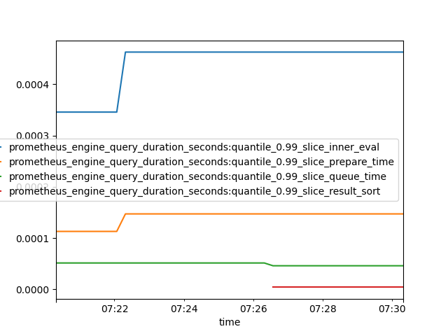

# Parides 

Parides is a simple python module/script to convert Prometheus metrics data 
to a pandas data frame, or a comma-separated file. 

## Docker
The metrics are converted to a CSV file which is stored to the docker-mounted 
folder. 

    docker run \
        -v $(pwd)/timeseries:/usr/src/app/timeseries \
        -i goettl/parides \
            http://192.168.1.114:9090 "{__name__=~\".+\"}>0"
            
## Python

Same example as above, however using a python cli
 
    pip install parides
    parides http://192.168.1.114:9090 {__name__=~\".+\"}>0
    
## Example

**A Simple Plot:** Extended example from above using a dataframe and matplotlib to
visualize a simple timeseries (cpu metrics).
     
    from matplotlib import pyplot
    from parides.prom_conv import from_prom_to_df
    df = from_prom_to_df(
        resolution="15s",
        url="http://192.168.1.114:9090",
        metrics_query="irate(node_cpu_seconds_total{instance=\"192.168.1.114:9100\"}[5m]) * 100"
    )
    df.plot()
    pyplot.show()

