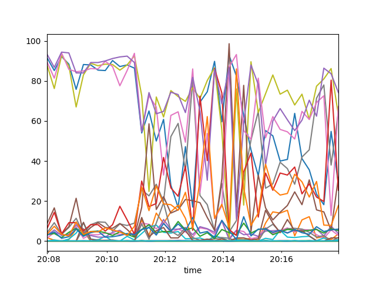

# Parides 

Parides is a simple python module/script to convert Prometheus metrics data to a matrix in the form of a pandas data frame
 or a comma-separated file. 
 
For a jumpstart at the console, use on of the commands below. 
The CSV file is created in the specified 
folder, containing Prometheus data from the last 5 minutes.

## Docker

    docker run \
        -v $(pwd)/timeseries:/usr/src/app/timeseries \
        -i goettl/parides \
            http://192.168.1.114:9090 "{__name__=~\".+\"}>0"
            
## Python

    pip install parides

    
    
**Console:** 
    
    parides http://127.0.0.1:9090 {__name__=~\".+\"}>0
    
    
**Simple Plot:**
     
    from matplotlib import pyplot
    from parides.prom_conv import from_prom_to_df
    df = from_prom_to_df(
        resolution="15s",
        url="http://192.168.1.114:9090",
        metrics_query="prometheus_engine_query_duration_seconds{quantile=\"0.99\"}"
    )
    df.plot()
    pyplot.show()

