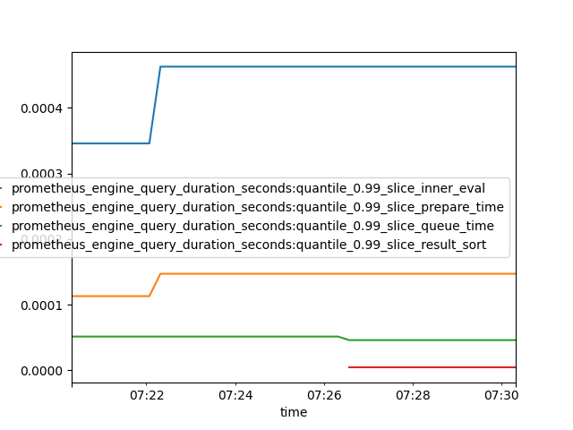

# PYTHON
First install inside a virtual environment:

    python -m venv venv
    source venv/bin/activate  # On Windows: venv\Scripts\activate
    pip install parides

### Basic Usage
Now make a simple matplot using data from a prom instance:

```python
from matplotlib import pyplot
from parides.prom_conv import from_prom_to_df

# Fetch data (automatically handles pagination in 6h chunks by default)
df = from_prom_to_df(
    url="http://localhost:9090",
    metrics_query="prometheus_engine_query_duration_seconds{quantile=\"0.99\"}",
    resolution="15s"
)

df.plot()
pyplot.show()
```
    


# CLI

Parides provides a powerful CLI for exporting Prometheus data to **CSV** or **Parquet**. It is optimized for **Big Data** using streaming writes to minimize memory usage.

### CLI Examples

**Example 1: Basic Export** (Last 10 minutes to CSV)

    parides http://localhost:9090 'up'

**Example 2: Subset with PromQL**

    parides http://localhost:9090 'http_requests_total{status="200"}'

**Example 3: Historical Data with custom resolution**
  
    parides http://localhost:9090 'node_cpu_seconds_total' \
        --start-date "2024-03-01T00:00:00Z" \
        --end-date "2024-03-02T00:00:00Z" \
        --resolution "1m"

**Example 4: Parquet Export (Recommended for DS)**

    parides http://localhost:9090 'up' --format parquet

**Example 5: Big Data Export (Streaming)**
For very large time ranges, use `--chunk-size` to control pagination. Parides will stream data directly to disk.

    parides http://localhost:9090 'node_memory_MemFree_bytes' \
        --start-date "2024-01-01T00:00:00Z" \
        --end-date "2024-04-01T00:00:00Z" \
        --resolution "5m" \
        --chunk-size "1d" \
        --format parquet
